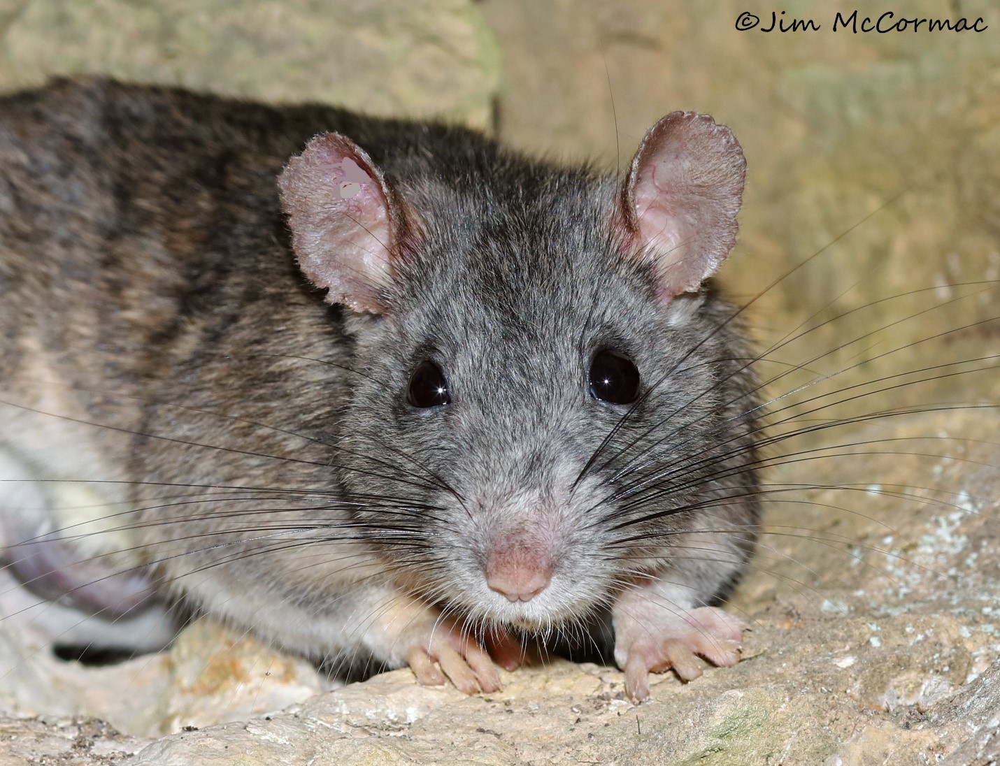

```{r setup, include=FALSE}
options(scipen = 1, digits = 2) #changes outputs to to decimal places.
knitr::opts_chunk$set(echo = FALSE)
packages_needed <- c("ggplot2", # graphics
                     "arm", # display() etc.
                     "ggfortify", # check model assumptions
                     "AICcmodavg", #average AIC models
                     "grid" #arrange objects
                     )
pk_to_install <- packages_needed [!( packages_needed %in% rownames(installed.packages())  )]
if(length(pk_to_install)>0 ){
  install.packages(pk_to_install,repos="http://cran.r-project.org")
}
#lapply(packages_needed, require, character.only = TRUE)
library(ggplot2)
library(arm)
library(ggfortify)
library(AICcmodavg)
library(grid)
library(tidyverse)
library(gtsummary)
library(gt)
library(flextable)
library(dplyr)
library(knitr)
library(leaflet)
library(hexbin)
```

# Allegheny Woodrat Ex

This data documents the regional occupancy of Allegheny Woodrat (*Neotoma magister*) across western Virginia. This species is listed as **Near Threatened** on the IUCN red list, and in Virginia, the Allegheny Woodrat is a species of greatest conservation need that has had drastic reductions in their geographic range in the past 40 years. 
For this data, the response variable is Woodrat presence or absence, and the predictor variables are elevation and distance to the nearest neighboring outcrop.




```{r import data, message=FALSE, warning=FALSE}
library(readr)
woodrat <- read_csv("alleghenywoodrat.csv")
```


``` {r clean up data, warning=FALSE}

#get rid of NA values in 'sex'
#avifauna <- avifauna %>% 
#  filter(!is.na(sex))

#get rid of - valies in 'TN' columns
woodrat <- woodrat %>%
  filter(TN2 != "-")

woodrat <- woodrat %>%
  rename("Isolation" = "Isolation-by-distance")
  
woodrat <- transform(woodrat, TN2 = as.numeric(TN2))

woodrat <- transform(woodrat, TN3 = as.numeric(TN3))

woodrat <- transform(woodrat, TN4 = as.numeric(TN4))
```

# Plots


```{r plot_TN1iso, message=FALSE, warning=FALSE}
ggplot(woodrat, aes(Isolation, TN1)) +
  geom_point(size=1) +
  geom_smooth(method="glm", method.args=list(family="quasibinomial"(link="logit"))) +
  labs(title="Woodrat (presence/absence) TN1") +
  ylab ("Probability of Occurrence") +
  xlab ("Distance to nearest neighboring outcrop (m)")
```


```{r plotTN2iso, message=FALSE, warning=FALSE}
ggplot(woodrat, aes(Isolation, TN2)) +
  geom_point(size=1) +
  geom_smooth(method="glm", method.args=list(family="quasibinomial"(link="logit"))) +
  labs(title="Woodrat (presence/absence) TN2") +
  ylab ("Probability of Occurrence") +
  xlab ("Distance to nearest neighboring outcrop (m)")
```


```{r plot_TN1ele, message=FALSE, warning=FALSE}
ggplot(woodrat, aes(Isolation, TN3)) +
  geom_point(size=.5) +
  geom_smooth(method="glm", method.args=list(family="quasibinomial"(link="logit"))) +
  labs(title="Woodrat (presence/absence) TN3") +
  ylab ("Probability of Occurrence") +
  xlab ("Distance to nearest neighboring outcrop (m)")
```


```{r plotTN2ele, message=FALSE, warning=FALSE}
ggplot(woodrat, aes(Isolation, TN4)) +
  geom_point(size=.5) +
  geom_smooth(method="glm", method.args=list(family="quasibinomial"(link="logit"))) +
  labs(title="Woodrat (presence/absence) TN4") +
  ylab ("Probability of Occurrence") +
  xlab ("Distance to nearest neighboring outcrop (m)")
```

# Binomial and Quasibinomial summary models

**GLM of TN1 ~ Isolation**
```{r model_isolation_TN1, message=FALSE, warning=FALSE}
model_woodrat <- glm(TN1 ~ Isolation, data=woodrat, family=binomial)

summary(model_woodrat)

```


**Quasibinomial model**
```{r model_isolation_tn1_quasi, message=FALSE, warning=FALSE}
model_woodrat <- glm(TN1 ~ Isolation, data=woodrat, quasibinomial)

summary(model_woodrat)

```


**GLM of TN2 ~ Isolation**
```{r model_elevation_tn2, message=FALSE, warning=FALSE}
model_woodrat2 <- glm(TN2 ~ Isolation, data=woodrat, binomial)

summary(model_woodrat2)

```


**Quasibinomial model**
```{r model_elevation_tn2_quasi, message=FALSE, warning=FALSE}
model_woodrat2 <- glm(TN2 ~ Isolation, data=woodrat, quasibinomial)

summary(model_woodrat2)

```


**GLM of TN3 ~ Isolation**
```{r model_isolation_TN3, message=FALSE, warning=FALSE}
model_woodrat3 <- glm(TN3 ~ Isolation, data=woodrat, family=binomial)

summary(model_woodrat3)

```

**Quasibinomial model**
```{r model_isolation_tn3_quasi, message=FALSE, warning=FALSE}
model_woodrat3 <- glm(TN3 ~ Isolation, data=woodrat, quasibinomial)

summary(model_woodrat3)

```


**GLM of TN4 ~ Elevation**
```{r model_elevation_tn4, message=FALSE, warning=FALSE}
model_woodrat4 <- glm(TN4 ~ Isolation, data=woodrat, binomial)

summary(model_woodrat4)

```

**Quasibinomial model**
```{r model_elevation_tn4_quasi, message=FALSE, warning=FALSE}
model_woodrat4 <- glm(TN4 ~ Isolation, data=woodrat, quasibinomial)

summary(model_woodrat4)

```


```{r check for overdispersion, message=FALSE, warning=FALSE}
library(arm)
x <- predict(model_woodrat)
y <- resid(model_woodrat)
binnedplot(x, y,
           main = "TN1 Isolation Binned residual plot")
```

```{r check for overdispersion2, message=FALSE, warning=FALSE}
library(arm)
x <- predict(model_woodrat2)
y <- resid(model_woodrat2)
binnedplot(x, y,
           main = "TN2 Isolation Binned residual plot")
```

```{r check for overdispersion3, message=FALSE, warning=FALSE}
library(arm)
x <- predict(model_woodrat3)
y <- resid(model_woodrat3)
binnedplot(x, y,
           main = "TN3 Isolation Binned residual plot")
```


```{r check for overdispersion4, message=FALSE, warning=FALSE}
library(arm)
x <- predict(model_woodrat4)
y <- resid(model_woodrat4)
binnedplot(x, y,
           main = "TN4 Elevation Binned residual plot")
```
# Coefficients and Estimations

**Model 1** (TN1 ~ Isolation)
```{r woodrat model coefficients, message=FALSE}
coef(model_woodrat)
```

```{r woodrat model confidence intervals, message=FALSE}
confint(model_woodrat)
```


To estimate the maximum predicted effect on the response of a unit change in the predictor, we can divide -.086/4 = -.0215 ~ -2.15%. A difference in 1 unit of distance to nearest neighboring outcrop (m) corresponds to a decrease in the probability of Woodrat presence of 2.15%.


**Model 2** (TN2 ~ Isolation)

```{r woodrat model coefficients2, message=FALSE}
coef(model_woodrat2)
```

```{r woodrat model confidence intervals2, message=FALSE}
confint(model_woodrat2)
```
A difference in 1 unit of distance to nearest neighboring outcrop (m) corresponds to a decrease in the probability of Woodrat presence of .725%.


**Model 3** (TN3 ~ Isolation)
```{r woodrat model coefficients3, message=FALSE}
coef(model_woodrat3)
```

```{r woodrat model confidence intervals3, message=FALSE}
confint(model_woodrat3)
```

A difference in 1 unit of unit of distance to nearest neighboring outcrop (m) corresponds to a decrease in the probability of Woodrat presence of 3.25%.

**Model 4** (TN4 ~ Isolation)
```{r woodrat model coefficients4, message=FALSE}
coef(model_woodrat4)
```

```{r woodrat model confidence intervals4, message=FALSE}
confint(model_woodrat4)
```

A difference in 1 unit of distance to nearest neighboring outcrop (m) corresponds to a decrease in the probability of Woodrat presence of 1.23%